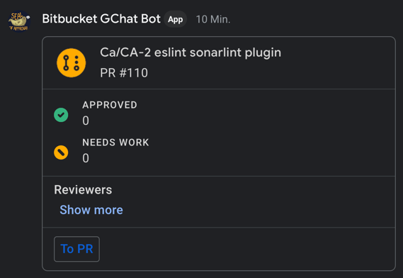
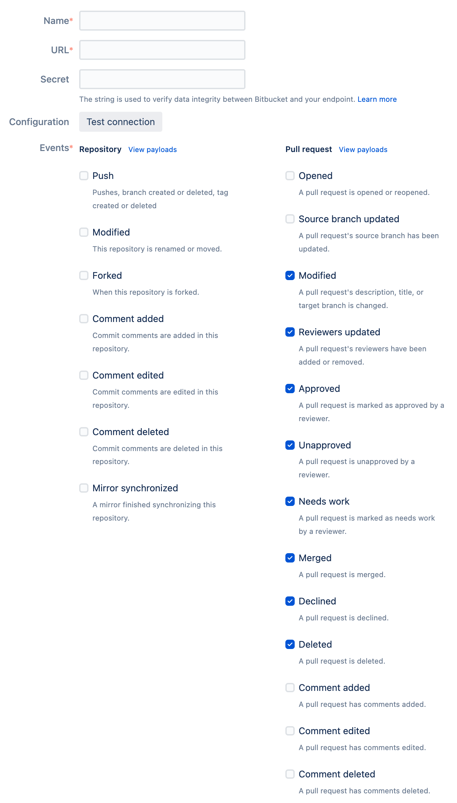

# Bitbucket Server to Google Chat Bot

This Google Chat App publishes pull requests and their state via Web Hooks from Bitbucket Server.

A pull request is only shared, when rewiers are added.
Every update to the pull request updates the message from this Google Chat App.

# Deploy the Chat Bot

1. Create a dedicated user in Bitbucket to use for requests and generate a token
2. Generate a secret, something like a random password with a generator of your choice and write it down. We need a secret between Bitbucket Server and the Firebase functions for validation.
2. Create a Firebase project and edit `.firebaserc` to change the default project to your Firebase project.
3. Go to your Google Project and enable the [Google Chat API](https://console.cloud.google.com/marketplace/product/google/chat.googleapis.com).
4. Deploy you project for the first time
    1. When prompted enter
        1. the secret,
        2. the Google project ID of your Firebase project in Google Cloud Console,
        3. the base URL to your bitbucket server
        4. the bitbucket user
        5. the personal access token of that user
    2. All secrets are automatically stored within Google's secret manager and all other fields as environment variables for the Firebase functions
    3. Copy the endpoint URL of the Firebase function.
5. Go back to your Google Project and manage the [Google Chat API](https://console.cloud.google.com/marketplace/product/google/chat.googleapis.com).
6. Go to "Configure" and insert name, avatar (as dummy you can use https://goo.gl/yKKjbw), and description.
   Choose if it should repond to direct messages or room mentions.
   (not yet: Choose the "bot url" with the Firebase function's endpoint url that you just deployed. And at last restrict the access to certain users or the whole organisation.)
7. Start the reporting by configuring repo and bot per repository in the next section

# Let the bot report

8. Go to your Bitbucket server repository and create a webhook with
    1. the generated shared secret
    2. the function's endpoint URL
    3. enabled for
        1. PR modified,
        2. reviewer updated,
        3. reviewer approved,
        4. reviewer unapproved,
        5. reviewer needs work,
        6. PR merged,
        7. PR declined and
        8. PR deleted
9. Mention or add the Bot within any Google chat channel with `/add <project key> <repo slug>` to let him report PRs with reviewers to that channel

The complete webhook config:

# Verification of bot authenticity

This is an important part. Because Firebase endpoints are public and there is no authentication mechanics to Firebase auth, it is necessary to filter out bad requests.

Google sends a JSON-Web-Token (JWT) with each message to the endpoint which must be verified to ensure that the request comes from Google Chat.
Verification of bot authenticity is made as described in the docs: https://developers.google.com/chat/how-tos/bots-develop#verifying_bot_authenticity.
Look into it for necessary changes in `config.ts` to `chatIssuer` and the `jwksUri`. [Jwks](https://auth0.com/docs/tokens/json-web-tokens/json-web-key-sets) is just another kind of keychain instead of [x509](https://en.wikipedia.org/wiki/X.509) and both provided by Google: https://www.googleapis.com/service_accounts/v1/metadata/x509/chat@system.gserviceaccount.com, https://www.googleapis.com/service_accounts/v1/metadata/jwk/chat@system.gserviceaccount.com, where `chat@system.gserviceaccount.com` is the issuer.

Bitbucket Server sends a generated sha256 hash of the payload with the shared secret.
In order to validate the payload the Firebase function also hashes the request payload.
If the hash is not equal, it was most likely manipulated or not send by your Bitbucket server.
See https://confluence.atlassian.com/bitbucketserver084/manage-webhooks-1167707976.html#Managewebhooks-Securingyourwebhook.
